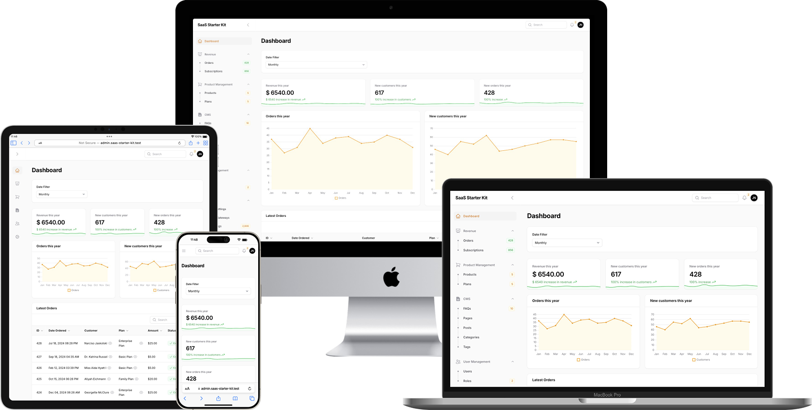
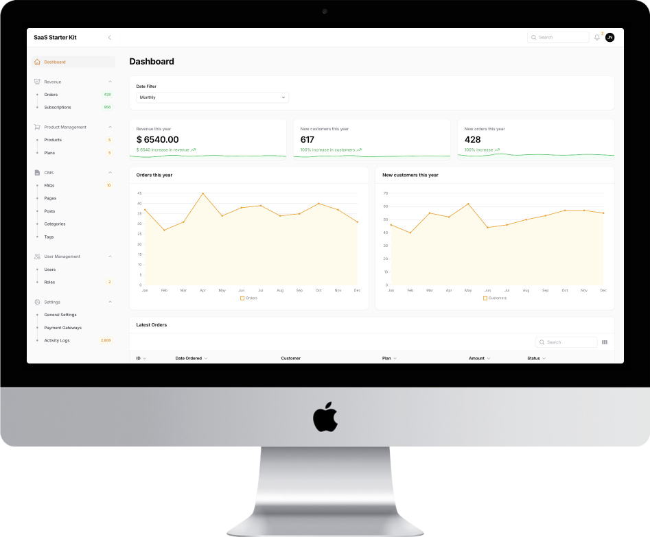
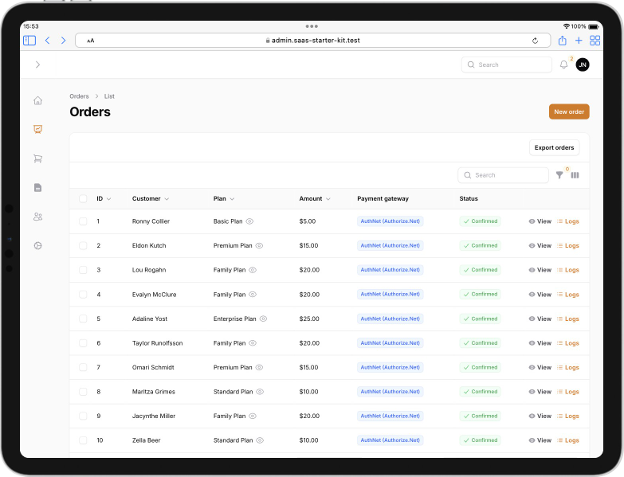
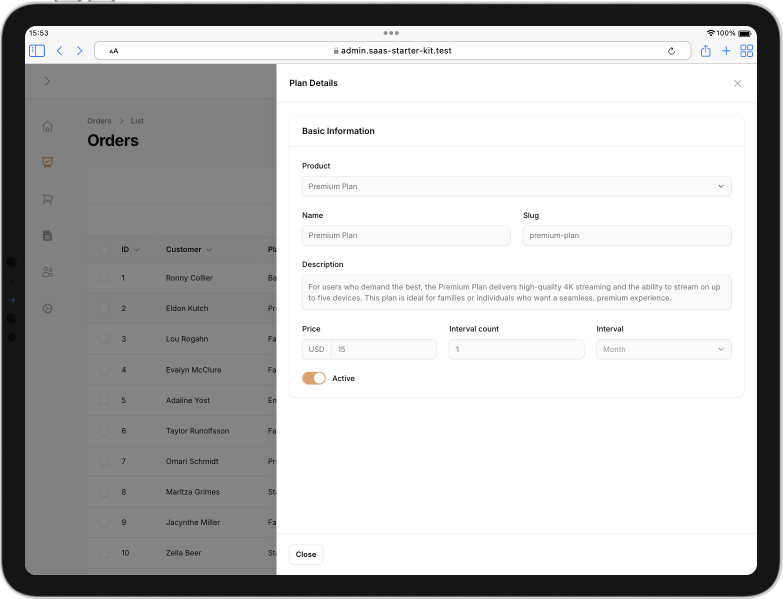
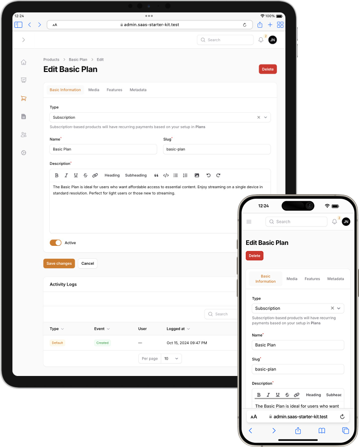
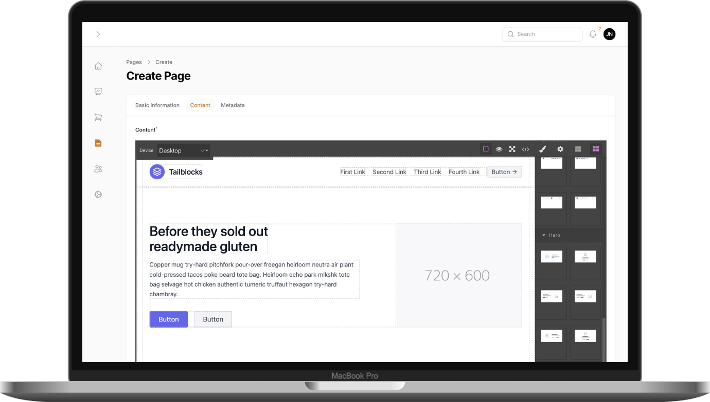
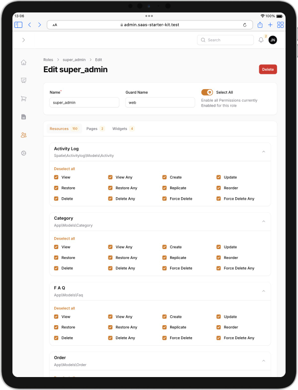
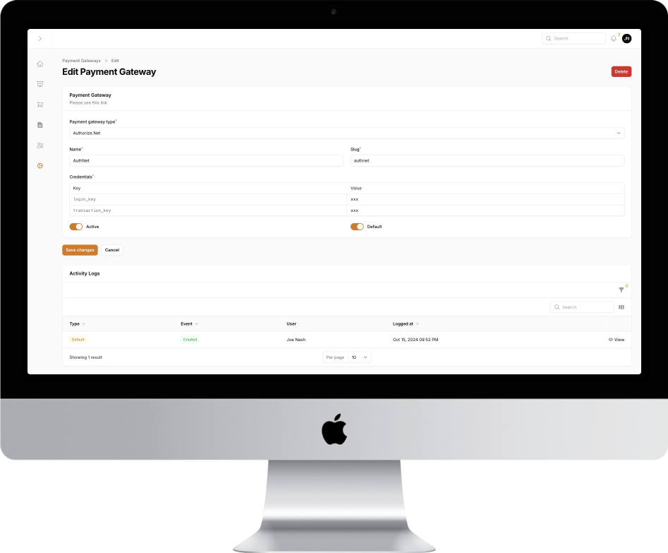
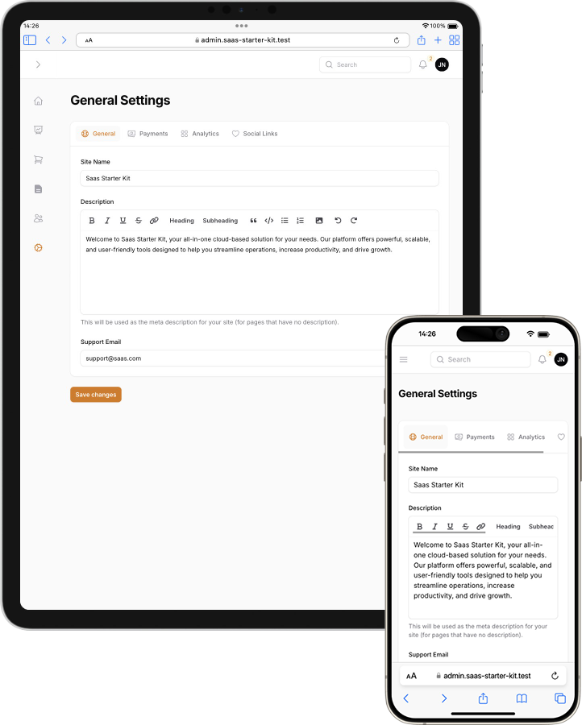

# SaaS Starter Kit (Demo)

An overview on how **SaaS Starter Kit** works.

## What is SaaS Starter Kit?

**Unlock Your SaaS Potential with Our Ready-to-Launch Boilerplate**

Building a SaaS product from the ground up is time-consuming, costly, and complex. Why reinvent the wheel? **SaaS Starter Kit** is a boilerplate that provides a powerful, scalable, and customizable foundation so you can fast-track your development, reduce costs, and focus on what really matters—growing your business.

**Key Features:**
- **Pre-Built Authentication & User Management:** Secure, scalable login, registration, password reset, and user roles right out of the box.
- **Payment Integration:** Subscription management with *Authorize.Net* (or your preferred payment gateway provider)
- **Admin Dashboard:** Full control over users, metrics, and features with an easy-to-use admin interface.
- **Responsive UI/UX:** Modern design and a seamless experience across devices.
- **API-First Architecture:** Ready to integrate with third-party services or mobile apps.
- **Scalable Infrastructure:** Built on top of a cloud-ready architecture that scales as your user base grows.

**Why Choose SaaS Starter Kit?**
- **Save Development Time:** Jumpstart your SaaS with essential features already built.
- **Cut Costs:** Eliminate the need for a full development team to build from scratch.
- **Focus on Innovation:** Spend more time perfecting your product rather than building backend systems.
- **Secure & Reliable:** Robust security features are baked into the foundation, keeping your app and users safe.

## Dashboard

A real-time overview of essential metrics such as revenue and customers.

  

## Revenue

Manage customer orders, subscription plans, and billing cycles. Automate renewals, handle upgrades or cancellations, and view comprehensive order histories to ensure smooth subscription management.

  
  

## Product Management

Organize and control your product or service offerings. Easily create, modify, and categorize products, set pricing, and manage availability, ensuring efficient catalog management.

  

## CMS (Content Management System)

Manage your website's content with a flexible editor. Update pages, create FAQs, publish blogs, and manage media with no coding required, while maintaining SEO optimization and a cohesive brand presence.

  

## User Management

Handle user authentication, roles, and permissions. Securely manage user accounts, monitor activity, and set different access levels for admins, customers, or staff members.

  

## Payment Gateways

Integrated support for popular payment providers like *Authorize.Net*, enabling secure transactions.

  

## Settings

A comprehensive module for configuring system preferences, email notifications, and platform customization. Allows easy fine-tuning of both technical and business settings.

  

## Support
This project was generated with [Laravel](https://laravel.com/) and [Filament](https://filamentphp.com).

For support, email jeddsaliba@gmail.com.
